# What's in a Planetfile?

## Examining a OSMPBF, Byte-by-Byte

When you first try to work with a binary file, it might seem beyond comprehension.

For example, if you were to use `more` on a PBF Planetfile, you'll be greeted with a screen of what is, for all practical intents, complete gibberish.


This is because more looks at each byte and tries to display it as an ASCII character.  Not all ASCII characters are English characters.  Some are special control codes meant to tell your computer how to display text on the screen.

Instead, we can use a utility designed for binary files, like `xxd`.

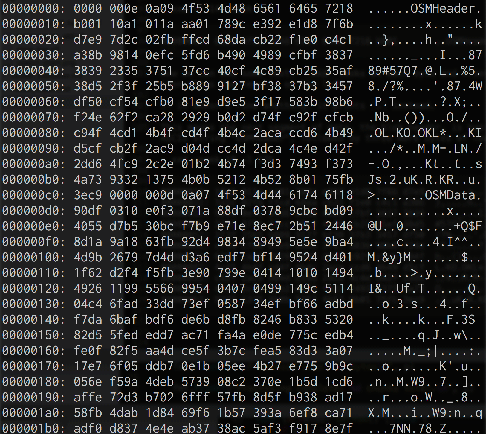

It's still a *lot* of information to take in, and there's no real way for us to know what's going on without reading the format specification, but we now have the address of the first byte in each line on the left, followed by sixteen bytes per line, followed by an attempt to render the bytes as ASCII characters.

Unlike `more`, which assumes you're reading a text file and renders everything, `xxd` will replace any nonprintable characters with `.`.

This makes things easier, but it's still a lot to take in.  To help, I've made a diagram of the first part of the data, the file header, labeled with its meaning.

Note that I didn't do anything particularly special to figure out what each of these bytes mean.  I simply read through the [PBF Format](https://wiki.openstreetmap.org/wiki/PBF_Format) article on the OpenStreetMap wiki, and played around with some [code that uses it at a low level](https://github.com/qedus/osmpbf).

Don't worry if you don't have time to read through this yourself! We'll go through each part through the course of this article.

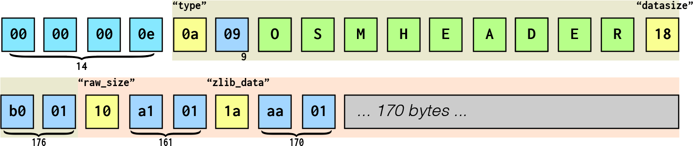

Each square represents a byte.  Inside each is written its corresponding hex code, which is like a normal number but in base 16 instead of base 10.  Two hex digits can represent very possible byte value (0-FF), which would take three decimal digits (0-255).

When a byte represents an ANSI character, I've used that character instead of the byte value and colored the square green.  The rest of the squares are colored based on what type of value they contain.

## Fileformat

You might notice we're skipping a whole bunch of bytes (in the grey box), as if they're not important.  This is because we're going to get back to them after we're done looking at the first part of the OSMPBF specification, [fileformat](https://wiki.openstreetmap.org/wiki/PBF_Format#File_format).  The fileformat doesn't contain any actual map data, but it gives us information about chunks of map data, [OSMData](https://wiki.openstreetmap.org/wiki/PBF_Format#Definition_of_OSMData_fileblock), which are compressed using zlib and placed in those grey boxes for later extraction.

For now, we'll focus on the file format, so we can get a better understanding of how ProtocolBuffers work.

Let's start learning more about each byte.

### Size Delimiter

We can use `xxd -l` to specify the length that we want to look at.

Let's use that to look at the first four bytes, which represent the size of the next block of data.

> xxd -l 4 data/pbfs/district-of-columbia-latest.osm.pbf

```
00000000: 0000 000e                                ....
```

Or, a slightly friendlier view, from our diagram.

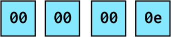

This is a pretty easy one; all we have to do is translate this from base16 (hex) to base10.  This is something that computers do better than humans, so I'd recommend using your favorite programming language or [an online calculator](https://www.rapidtables.com/convert/number/base-converter.html) instead of trying to do it manually.

We can ignore the first three bytes entirely, as they're all 0 and leading zeroes don't mean anything; 0000000E is the same as 0E, which is the same as E.  In hex notation, E is equal to 14.

Now we know that the next chunk of data that we want to process is fourteen bytes long.

Again, we can take a look at it using xxd, which also has a `-seek` option to specify the first byte to look at.  We'll set `-seek` to 4 because we've already looked at the first four bytes and don't need to see them again.

### BlobHeader

> xxd -l 14 -seek 4 data/pbfs/district-of-columbia-latest.osm.pbf

```
00000004: 0a09 4f53 4d48 6561 6465 7218 b001       ..OSMHeader...
```

Just looking at xxd, we can tell we're probably looking at an OSMHeader.

Let's look at the diagram for a better view of what these fourteen bytes mean.

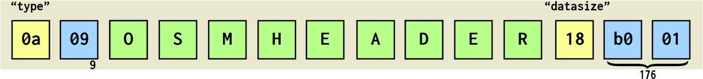

This is a [ProtocolBuffer](https://developers.google.com/protocol-buffers/docs/encoding) message.  ProtocolBuffer is a binary format made by Google and then [opensourced](https://github.com/google/protobuf).  It's a lot like JSON, but designed to be smaller and faster, and readable by many different programming languages so that separate codebases can send messages to each other to get things done.

The first byte, `0A`, tells us the field and datatype of the data that follows it.  This is actually *two* values smooshed into a single byte, so we have to go through it...


...bit-by-bit.

The first five bits tell us the number of the field.

The next three bytes represent the *wire type* or what *kind* of data is coming up next.  [Google's documentation](https://developers.google.com/protocol-buffers/docs/encoding#structure) has a table of all available wire types, which we can use to lookup what kind of data is coming up next.

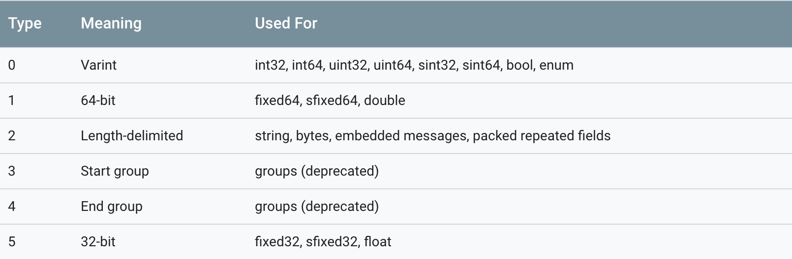

So, zooming into `0A` byte and looking at each of its eight bits individually, we can see that the field number is 1, and the wire type is 2.

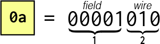

We know that this is a [BlobHeader](https://wiki.openstreetmap.org/wiki/PBF_Format#File_format) because it's documented on the OSMWiki.  A BlobHeader's data definition looks like this...

```
message BlobHeader {
  required string type = 1;
  optional bytes indexdata = 2;
  required int32 datasize = 3;
}
```

The second line of our BlobHeader definition (`string type = 1;`) tells us that anything with a field number of 1 is a "type" field.

The wiretype table tells us that a wire type of 2 is a *length-delimited string*.  That means we'll have one or more bytes that tell us the *length* of the string, followed by that many bytes containing the ASCII codes for the string itself.

Which means the *first two bytes* in this segment, `0A` and `09` tell us that there is a nine-character string coming up next.  When we grab the next nine bytes and convert them to ASCII, we get the string "OSMHeader".

If we were using JSON, we could encode the same information as `{"type":"OSMHeader"}`, but it would take 20 bytes instead of 11, and wouldn't give us the same level of insight into what type of data we're looking at.

After we're done processing all nine bytes of our string, we know that we're done with that data and the next byte must represent the next field and wiretype.

Next up is `x18`, or `00011000` in binary.

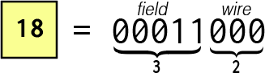

This has a field number of 3 (`00011`), so it represents the datasize.  Its wire type is 0, meaning it's a *varint*.

Varints are a bit tricky.  Thankfully, we have a bunch of them to practice with!

The largest number that you can store in one byte is 255 (hex FF).  If you know you need larger numbers than that, you can specify more bytes for your data.  For example, with two bytes we can store up to 65,535 (hex FFFF), with three bytes 16,777,215 (hex FFFFFF), and so forth.

Varints allow us to store *any number* we choose, without reserving bytes that we might not need for it.  It does this by using the first bit of each byte to tell us whether or not we need to look at the next byte.  If we were feeling fancy we could call this first bit the *Most Significant Bit*, or MSB.

If the first bit of the byte (MSB) is one, we need to look at the next byte.  If it's zero, we have all the bytes we need to process the number.

If we look at our next byte, `xB0`, in binary, we can see that the first bit is set to 1.

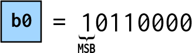

This means that the next byte is also part of our number.  The remaining seven bits are the first bits of our number.

Next up is the byte `x01`, which is the easiest number to translate.  It's 1 in base10, 1 in hex, and 1 in binary.

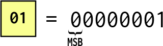

We can see that the MSB is set to zero, meaning that this is the last byte that we need to parse our number.

If we take the last seven bits of each of these bytes, we get `01100001` and `00000001`.

The one tricky thing we have to do is reassemble these bytes in *reverse* order, but then we'll be done!

That means we take `00000001` (from x01) and put it in front of `01100001` (from xB0) to get `0000000101100001`.  We can trim off the leading zeros to get `101100001`, or 176.

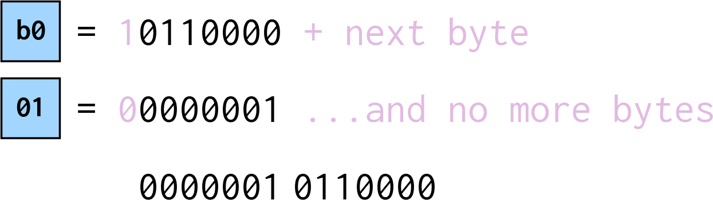

Phew, that's a lot of work.

But now we can see that this line from our xxd output...

> xxd -l 14 -seek 4 data/pbfs/district-of-columbia-latest.osm.pbf

```
00000004: 0a09 4f53 4d48 6561 6465 7218 b001       ..OSMHeader...
```

Can be translated, in JSON, to `{"type": "OSMHeader", "datasize": 176}`.

That's 39 bytes in JSON and just 14 in PBF.

Now we know that the next Blob is of the type "OSMHeader", and it has a datasize of 176.

Let's take a look!

### Blob

> xxd -l 176 -seek 18 data/pbfs/district-of-columbia-latest.osm.pbf

```
00000012: 10a1 011a aa01 789c e392 e1d8 7f6b d7e9  ......x......k..
00000022: 7d2c 02fb ffcd 68da cb22 f1e0 c4c1 a38b  },....h.."......
00000032: 9814 0efc 5fd6 b490 4989 cfbf 3837 3839  ...._...I...8789
00000042: 2335 3751 37cc 40cf 4c89 cb25 35af 38d5  #57Q7.@.L..%5.8.
00000052: 2f3f 25b5 b889 9127 bf38 37b3 3457 df50  /?%....'.87.4W.P
00000062: cf54 cfb0 81e9 d9e5 3f17 583b 98b6 f24e  .T......?.X;...N
00000072: 62f2 ca28 2929 b0d2 d74f c92f cfcb c94f  b..())...O./...O
00000082: 4cd1 4b4f cd4f 4b4c 2aca ccd6 4b49 d5cf  L.KO.OKL*...KI..
00000092: cb2f 2ac9 d04d cc4d 2dca 4c4e d42f 2dd6  ./*..M.M-.LN./-.
000000a2: 4fc9 2c2e 01b2 4b74 f3d3 7493 f373 4a73  O.,...Kt..t..sJs
000000b2: 9332 1375 4b0b 5212 4b52 8b01 75fb 3ec9  .2.uK.R.KR..u.>.
```

Don't worry, I've diagramed this one, too.

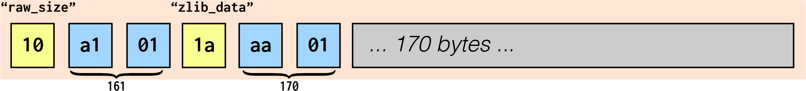

The good news is we only need to decode six bytes of this!

Let's take a look at the first byte in our Blob, `x10`.

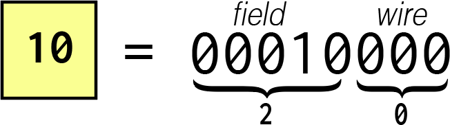

Looking at the [Blob](https://wiki.openstreetmap.org/wiki/PBF_Format#File_format) definition on the wiki, we can see that this is a field type of 2, or `raw_size`, and a wire type of our new favorite data type, `varint`!

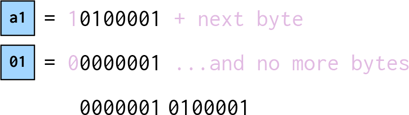

Decoding `xA101`, we get `0000001 ++ 0100001`, or `10100001`, which equals 161.

Now we know that the raw (uncompressed) size of our data is 161 bytes.

On to the next byte, another field/wire combo.

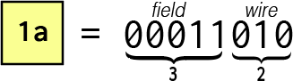

This has a field number of 3.  The Blob definition that this is our `zlib_data`.  The wiretype is 2, just like our string, which is also length-delimited!  This means that the following varint will contain the *length* of the value of the zlib_data field for this block.

Let's decode the varint to get the size.

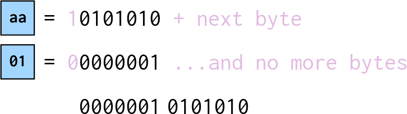

Decoding `xA101`, we get `0000001 ++ 0101010`, or `10101010`, which equals 170.

That means we can just grab the next 170 bytes, which contains our compressed data, and we're done processing our first Blob!

`{"raw_size": 161, "zlib_data": [170 bytes...] }`

### Our First Blob

Zooming out a bit, we can take a look at all the data we've processed so far.

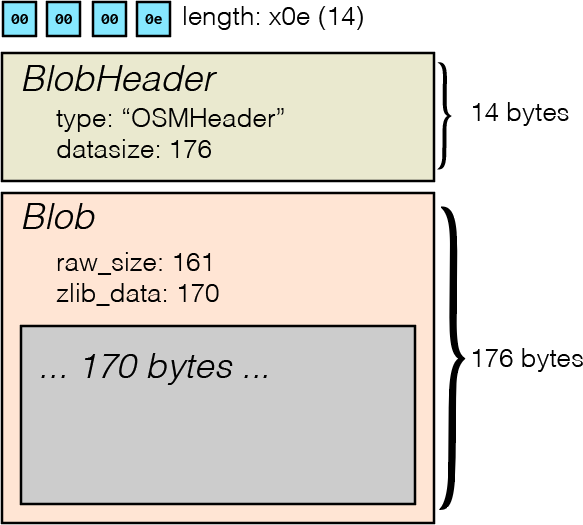

### Using ProtocolBuffer Libraries

That's a lot work!  Thankfully, Google has already [opensourced code](https://github.com/google/protobuf) to decode ProtocolBuffer formatted messages in all major languages.  The only thing we have to do is break up a file into individual messages, then *Unmarshal* them through the language-specific ProtocolBuffer library of our choice.

All we really have to do is look at the first *four* bytes of the file, grab that many bytes, and then pop them directly into the Unmarshal function of the protobuf library.


This will output our data, just like if we were using JSON!

```
{"type": "OSMHeader", "datasize": 176}
```

### The Second Blob

Now we can take a look at the next blob, which should look familiar by now.

We'll start at byte address 194, since we've already read the first 194 bytes.

> xxd -l 4 -seek 194 ./data/pbfs/district-of-columbia-latest.osm.pbf

```
000000c2: 0000 000d
```

We can grab the first four bytes to find the size of the next BlobHeader.  In this case, it's `x0d` bytes, or 13 in decimal.

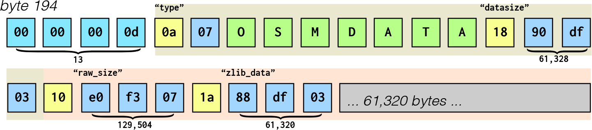

If we grab the next 13 bytes...

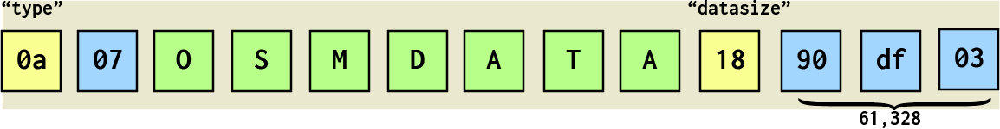

We get a BlobHeader, which tells us that we're dealing with an OSMData type with a size of 61,328 bytes.

```
{"type": "OSMData", "datasize": 61328}
```

Notice that the data type is different, but the Blob is exactly the same as before.

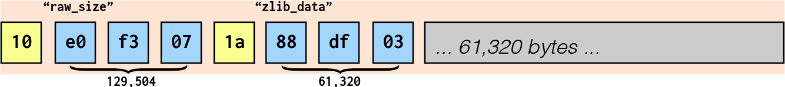

We know we're dealing with a zlib-compressed set of data with a size of 61,320 bytes.

```
{"raw_size": 161, "zlib_data": [170 bytes...] }
```

Zooming out, we should see that it looks very familiar.

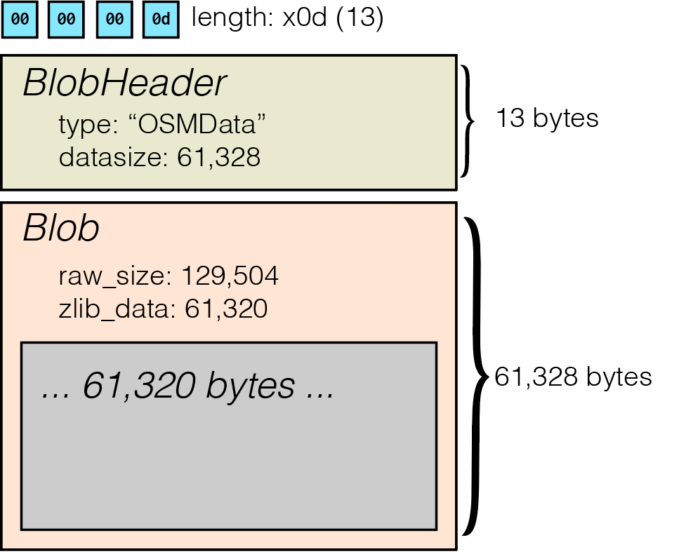

### Repeat Until End of File

Now we know how to parse the File Format part of PBF files!  It's just a repeating sequence of a four-byte size delimiter indicating the BlobHeader size, the BlobHeader containing the type and datasize of the Blob, and then the Blob.

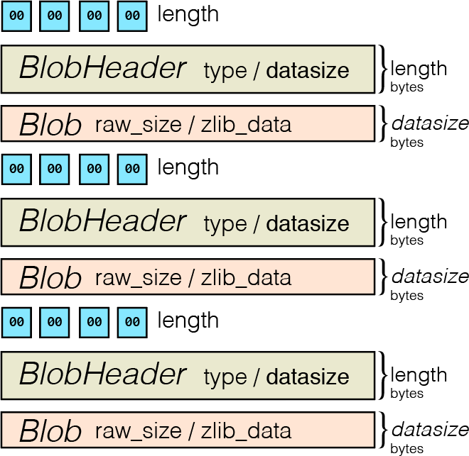

In pseudocode, the algorithm to go through all the blobs is pretty simple.

```
until (file.position == size_of_file) {
	length = decode_size(file.read(4));
	blob_header = protobuf.unmarshal(file.read(length))
	blob = protobuf.unmarshal(blob_header.datasize)
	// do things with the data
}
```