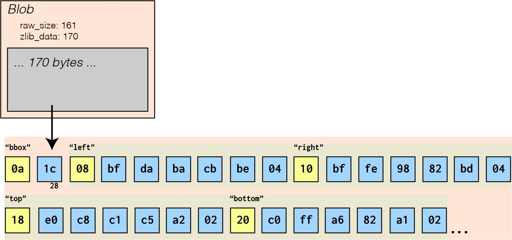
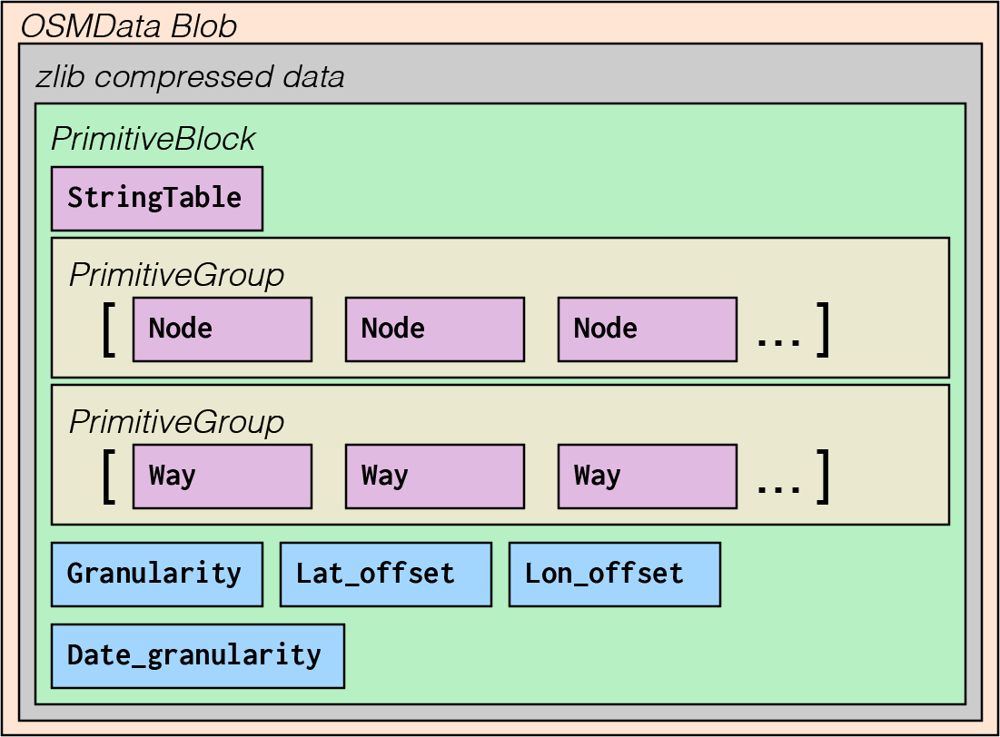
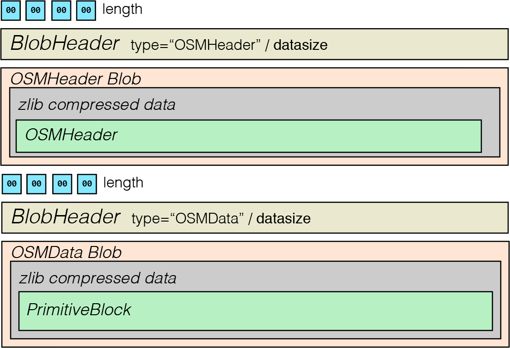
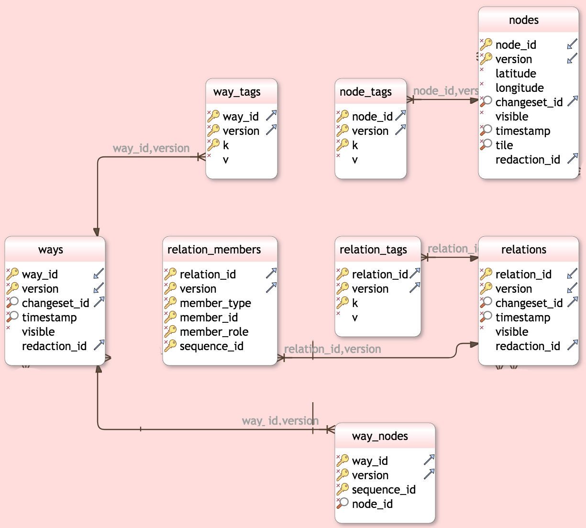
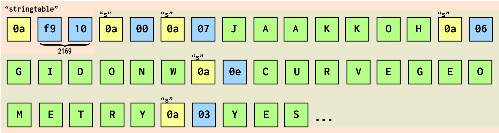
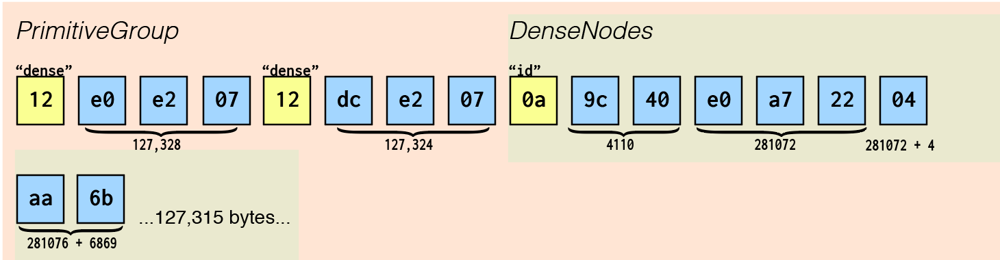
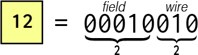

# What's in a Planetfile?

There are three main datatypes for OSM Planetfile data: Nodes, Ways, and Relations.

Unfortunately for us, they can be a bit hard to find at first glance.


So let's open up our example file and dig into the data ourselves.  You'll find an example OSMPBF file in [./examples/](./examples), so feel free to follow along as you read.

## Examining a OSMPBF, Byte-by-Byte

When you first try to work with a binary file, it might seem beyond comprehension.

For example, if you were to use `more` on a PBF Planetfile, you'll be greeted with a screen of what is, for all practical intents, complete gibberish.


This is because more looks at each byte and tries to display it as an ASCII character.  Not all ASCII characters are English characters.  Some are special control codes meant to tell your computer how to display text on the screen.

Instead, we can use a utility designed for binary files, like `xxd`.


It's still a *lot* of information to take in, and there's no real way for us to know what's going on without reading the format specification, but we now have the address of the first byte in each line on the left, followed by sixteen bytes per line, followed by an attempt to render the bytes as ASCII characters.

Unlike `more`, which assumes you're reading a text file and renders everything, `xxd` will replace any nonprintable characters with `.`.

This makes things easier, but it's still a lot to take in.  To help, I've made a diagram of the first part of the data, the file header, labeled with its meaning.

Note that I didn't do anything particularly special to figure out what each of these bytes mean.  I simply read through the [PBF Format](https://wiki.openstreetmap.org/wiki/PBF_Format) article on the OpenStreetMap wiki, and played around with some [code that uses it at a low level](https://github.com/qedus/osmpbf).

Don't worry if you don't have time to read through all that documentation yourself! We'll go through each part through the course of this article.

For these exercises we'll be looking at a [Geofabrik](http://download.geofabrik.de/north-america/us/district-of-columbia.html) regional extract of the District of Columbia.  You can find it in the examples directory.

To look at its byte values on your computer, try typing:

`xxd ./examples/district-of-columbia.osm.pbf` you might want to add `| more` to the end of of your command to only show you one screen's worth of bytes at a time.

We'll be using `xxd` a little bit to explore the file, but I've also created a diagram to look at.


Each square represents a byte.  Inside each is written its corresponding hex code, which is like a normal number but in base 16 instead of base 10.  Two hex digits can represent very possible byte value (0-FF), which would take three decimal digits (0-255).  In descriptions, we can use `x` in front of our hex values so that they don't get confused with decimal.  For example, `x18` is equal to 24 in decimal.

When a byte represents an ANSI character, I've used that character instead of the byte value and colored the square green.  The rest of the squares are colored based on what type of value they contain.

## Fileformat

You might notice we're skipping a whole bunch of bytes (in the grey box), as if they're not important.  This is because we're going to get back to them after we're done looking at the first part of the OSMPBF specification, [fileformat](https://wiki.openstreetmap.org/wiki/PBF_Format#File_format).  The fileformat doesn't contain any actual map data, but it gives us information about chunks of map data, [OSMData](https://wiki.openstreetmap.org/wiki/PBF_Format#Definition_of_OSMData_fileblock), which are compressed using zlib and placed in those grey boxes for later extraction.

For now, we'll focus on the file format, so we can get a better understanding of how ProtocolBuffers work.

Let's start learning more about each byte.

### Size Delimiter

We can use `xxd -l` to specify the length that we want to look at.

Let's use that to look at the first four bytes, which represent the size of the next block of data.

> xxd -l 4 ./examples/district-of-columbia.osm.pbf

```
00000000: 0000 000e                                ....
```

Or, a slightly friendlier view, from our diagram.


This is a pretty easy one; all we have to do is translate this from base16 (hex) to base10.  This is something that computers do better than humans, so I'd recommend using your favorite programming language or [an online calculator](https://www.rapidtables.com/convert/number/base-converter.html) instead of trying to do it manually.

We can ignore the first three bytes entirely, as they're all 0 and leading zeroes don't mean anything; 0000000E is the same as `x0E`, which is the same as `xE`.  In hex notation, `xE` is equal to 14.

Now we know that the next chunk of data that we want to process is fourteen bytes long.

Again, we can take a look at it using xxd, which also has a `-seek` option to specify the first byte to look at.  We'll set `-seek` to 4 because we've already looked at the first four bytes and don't need to see them again.

### BlobHeader

> xxd -l 14 -seek 4 ./examples/district-of-columbia.osm.pbf

```
00000004: 0a09 4f53 4d48 6561 6465 7218 b001       ..OSMHeader...
```

Just looking at xxd, we can tell we're probably looking at an OSMHeader.

Let's look at the diagram for a better view of what these fourteen bytes mean.


This is a [ProtocolBuffer](https://developers.google.com/protocol-buffers/docs/encoding) message.  ProtocolBuffer is a binary format made by Google and then [opensourced](https://github.com/google/protobuf).  It's a lot like JSON, but designed to be smaller and faster, and readable by many different programming languages so that separate codebases can send messages to each other to get things done.

The first byte, `x0A`, tells us the field and datatype of the data that follows it.  This is actually *two* values smooshed into a single byte, so we have to go through it bit-by-bit.


The first five bits tell us the number of the field.

The next three bytes represent the *wire type* or what *kind* of data is coming up next.

So, zooming into `x0A` byte and looking at each of its eight bits individually, we can see that the field number is 1, and the wire type is 2.


[Google's documentation](https://developers.google.com/protocol-buffers/docs/encoding#structure) has a table of all available wire types, which we can use to lookup what kind of data is coming up next.


We know that this is a [BlobHeader](https://wiki.openstreetmap.org/wiki/PBF_Format#File_format) because it's documented on the OSMWiki.  A BlobHeader's data definition looks like this...

```
message BlobHeader {
  required string type = 1;
  optional bytes indexdata = 2;
  required int32 datasize = 3;
}
```

The second line of our BlobHeader definition (`string type = 1;`) tells us that anything with a field number of 1 is a "type" field.

The wiretype table tells us that a wire type of 2 is a *length-delimited string*.  That means we'll have one or more bytes that tell us the *length* of the string, followed by that many bytes containing the ASCII codes for the string itself.

Which means the *first two bytes* in this segment, `x0A` and `x09` tell us that there is a nine-character string coming up next.  When we grab the next nine bytes and convert them to ASCII, we get the string "OSMHeader".

If we were using JSON, we could encode the same information as `{"type":"OSMHeader"}`, but it would take 20 bytes instead of 11, and wouldn't give us the same level of insight into what type of data we're looking at.

After we're done processing all nine bytes of our string, we know that we're done with that data and the next byte must represent the next field and wiretype.

Next up is `x18`, or `00011000` in binary.


This has a field number of 3 (`00011`), so it represents the datasize.  Its wire type is 0, meaning it's a *varint*.

Varints are a bit tricky.  Thankfully, we have a bunch of them to practice with!

The largest number that you can store in one byte is 255 (`xFF`).  If you know you need larger numbers than that, you can specify more bytes for your data.  For example, with two bytes we can store up to 65,535 (`xFFFF`), with three bytes 16,777,215 (`xFFFFFF`), and so forth.

Varints allow us to store *any number* we choose, without reserving bytes that we might not need for it.  It does this by using the first bit of each byte to tell us whether or not we need to look at the next byte.  If we were feeling fancy we could call this first bit the *Most Significant Bit*, or MSB.

If the first bit of the byte (MSB) is one, we need to look at the next byte.  If it's zero, we have all the bytes we need to process the number.

If we look at our next byte, `xB0`, in binary (10110000), we can see that the first bit is set to 1.


This means that the next byte is also part of our number.  The remaining seven bits are the first bits of our number.

Next up is the byte `x01`, which is the easiest number to translate.  It's 1 in base10, 1 in hex, and 1 in binary.


We can see that the MSB is set to zero, meaning that this is the last byte that we need to parse our number.

If we take the last seven bits of each of these bytes, we get `01100001` and `00000001`.

The one tricky thing we have to do is reassemble these bytes in *reverse* order, but then we'll be done!

That means we take `00000001` (from x01) and put it in front of `01100001` (from xB0) to get `0000000101100001`.  We can trim off the leading zeros to get `101100001`, or 176.


Phew, that's a lot of work!


But now we can see that this line from our xxd output...

> xxd -l 14 -seek 4 ./examples/district-of-columbia.osm.pbf

```
00000004: 0a09 4f53 4d48 6561 6465 7218 b001       ..OSMHeader...
```

Can be translated, in JSON, to `{"type": "OSMHeader", "datasize": 176}`.

That's 39 bytes in JSON and just 14 in PBF.

Now we know that the next Blob is of the type "OSMHeader", and it has a datasize of 176.

Let's take a look!

### Blob

> xxd -l 176 -seek 18 ./examples/district-of-columbia.osm.pbf

```
00000012: 10a1 011a aa01 789c e392 e1d8 7f6b d7e9  ......x......k..
00000022: 7d2c 02fb ffcd 68da cb22 f1e0 c4c1 a38b  },....h.."......
00000032: 9814 0efc 5fd6 b490 4989 cfbf 3837 3839  ...._...I...8789
00000042: 2335 3751 37cc 40cf 4c89 cb25 35af 38d5  #57Q7.@.L..%5.8.
00000052: 2f3f 25b5 b889 9127 bf38 37b3 3457 df50  /?%....'.87.4W.P
00000062: cf54 cfb0 81e9 d9e5 3f17 583b 98b6 f24e  .T......?.X;...N
00000072: 62f2 ca28 2929 b0d2 d74f c92f cfcb c94f  b..())...O./...O
00000082: 4cd1 4b4f cd4f 4b4c 2aca ccd6 4b49 d5cf  L.KO.OKL*...KI..
00000092: cb2f 2ac9 d04d cc4d 2dca 4c4e d42f 2dd6  ./*..M.M-.LN./-.
000000a2: 4fc9 2c2e 01b2 4b74 f3d3 7493 f373 4a73  O.,...Kt..t..sJs
000000b2: 9332 1375 4b0b 5212 4b52 8b01 75fb 3ec9  .2.uK.R.KR..u.>.
```

Don't worry, I've diagramed this one, too.


The good news is we only need to decode six bytes of this!

Let's take a look at the first byte in our Blob, `x10`.


Looking at the [Blob](https://wiki.openstreetmap.org/wiki/PBF_Format#File_format) definition on the wiki, we can see that this is a field type of 2, or `raw_size`, and a wire type of our new favorite data type, `varint`!


Decoding `xA101`, we get `0000001 ++ 0100001`, or `10100001`, which equals 161.

Now we know that the raw (uncompressed) size of our data is 161 bytes.

On to the next byte, another field/wire combo.


This has a field number of 3.  The Blob definition that this is our `zlib_data`.  The wiretype is 2, just like our string, which is also length-delimited!  This means that the following varint will contain the *length* of the value of the zlib_data field for this block.

Let's decode the varint to get the size.


Decoding `xA101`, we get `0000001 ++ 0101010`, or `10101010`, which equals 170.

That means we can just grab the next 170 bytes, which contains our compressed data, and we're done processing our first Blob!

`{"raw_size": 161, "zlib_data": [170 bytes...] }`

### Our First Blob

Zooming out a bit, we can take a look at all the data we've processed so far.


### Using ProtocolBuffer Libraries

That's a lot work!  Thankfully, Google has already [opensourced code](https://github.com/google/protobuf) to decode ProtocolBuffer formatted messages in all major languages.  The only thing we have to do is break up a file into individual messages, then *unmarshal* them through the language-specific ProtocolBuffer library of our choice.

All we really have to do is look at the first *four* bytes of the file, grab that many bytes, and then pop them directly into the Unmarshal function of the protobuf library.


This will output our data, just like if we were using JSON!

```
{"type": "OSMHeader", "datasize": 176}
```

### The Second Blob

Now we can take a look at the next blob, which should look familiar by now.

We'll start at byte address 194, since we've already read the first 194 bytes.

> xxd -l 4 -seek 194 ./examples/district-of-columbia.osm.pbf

```
000000c2: 0000 000d
```

We can grab the first four bytes to find the size of the next BlobHeader.  In this case, it's `x0d` bytes, or 13 in decimal.


If we grab the next 13 bytes...


We get a BlobHeader, which tells us that we're dealing with an OSMData type with a size of 61,328 bytes.

```
{"type": "OSMData", "datasize": 61328}
```

Notice that the data type is different, but the Blob is exactly the same as before.


We know we're dealing with a zlib-compressed set of data with a size of 61,320 bytes.

```
{"raw_size": 161, "zlib_data": [61328 bytes...] }
```

Zooming out, we should see that it looks very familiar.


### Repeat Until End of File

Now we know how to parse the File Format part of PBF files!  It's just a repeating sequence of a four-byte size delimiter indicating the BlobHeader size, the BlobHeader containing the type and datasize of the Blob, and then the Blob.


In pseudocode, the algorithm to go through all the blobs is pretty simple.

```
until (file.position == size_of_file) {
	length = decode_size(file.read(4));
	blob_header = protobuf.unmarshal(file.read(length))
	blob = protobuf.unmarshal(blob_header.datasize)
	// do things with the data
}
```

## Decoding Blobs

So far we've done a lot of bitshifting, but we haven't actually looked at any map data.

Let's decode our first blob.

If we take the bytes in that grey blob and run them through the zlib decompression algoritm, we'll get the following bytes:

```
00000000: 0a1c 08bf daba cbbe 0410 bffe 9882 bd04  ................
00000010: 18e0 c8c1 c5a2 0220 c0ff a682 a102 220e  ....... ......".
00000020: 4f73 6d53 6368 656d 612d 5630 2e36 220a  OsmSchema-V0.6".
00000030: 4465 6e73 654e 6f64 6573 8201 0c6f 736d  DenseNodes...osm
00000040: 6975 6d2f 312e 352e 3180 02e6 d3fc d005  ium/1.5.1.......
00000050: 8802 b50d 9202 4a68 7474 703a 2f2f 646f  ......Jhttp://do
00000060: 776e 6c6f 6164 2e67 656f 6661 6272 696b  wnload.geofabrik
00000070: 2e64 652f 6e6f 7274 682d 616d 6572 6963  .de/north-americ
00000080: 612f 7573 2f64 6973 7472 6963 742d 6f66  a/us/district-of
00000090: 2d63 6f6c 756d 6269 612d 7570 6461 7465  -columbia-update
000000a0: 73                                       s
```

We can see what data it contains by looking at the OSMPBF specification for [OSMHeader](https://wiki.openstreetmap.org/wiki/PBF_Format#Definition_of_the_OSMHeader_fileblock), which corresponds to the `HeaderBlock` section of the Protobuf specification.

```
message HeaderBlock {
  optional HeaderBBox bbox = 1;
  repeated string required_features = 4;
  repeated string optional_features = 5;
  optional string writingprogram = 16;
  optional string source = 17; // From the bbox field.
  optional int64 osmosis_replication_timestamp = 32;
  optional int64 osmosis_replication_sequence_number = 33;
  optional string osmosis_replication_base_url = 34;
}

```

The first byte, `x0a`, is pretty simple; we've already seen it before.  It means we have a field number of 1 and a wire type of 2.

The last time we looked at an `x0a` byte, that meant that we were looking at a `type` field from the BlobHeader specification as a length-delimited string.  This time, we're looking at the HeaderBlock specification, where the field number one is defined as a `HeaderBBox` type, which is a length-delimited (wiretype 2) range of bytes representing a `HeaderBBox`.

So how big is the HeaderBBox?  `x1c` as a varint, or 00011100 as a complete byte, which stripped of leading zeros is 11100 and converted to decimal (base10) is 28.

So the next 28 bytes represent a HeaderBBox!  Which means our next byte is the start of a new Message of the HeaderBBox type, which we should be able to guess by now is a field and wiretype byte.

Here's the specification for HeaderBBox.

```
message HeaderBBox {
   required sint64 left = 1;
   required sint64 right = 2;
   required sint64 top = 3;
   required sint64 bottom = 4;
}
```

We can go through the process of decoding the HeaderBlock and HeaderBBox manually, but it's probably best to just let the ProtocolBuffer library take care of things from here on out.



The important thing to note is the nesting of the data structure.


Here we have a Blob, which contains compressed data representing a Message, which itself contains Messages.  Once we're done decompressing the data, the ProtocolBuffer library will handle all of the nested Messages for us when we unmarshal each block of data.

## OSMData

Now that we understand how data is organized within a file, and we've decoded an example OSMHeader blob, let's dig into the mainstay of this format: OSMData blobs.

Every OSMPBF file contains one OSMHeader blob as its first blob, followed entirely by OSMData blobs.

Remember the nesting?  Good, because OSMData blobs are nested pretty deeply.

### PrimitiveBlock

PrimitiveBlocks still don't store our data, but they store a lot of metadata about the data they contain, along with a repeating field (array) of PrimitiveGroups.



The cool thing about PrimitiveBlocks is that they're completely self-contained.  If you take a Blob (and its BlobHeader) containing a PrimitiveBlock and you place an OSMHeader BlobHeader + Blob on top of it, you have a perfectly valid OSMPBF file.



### PrimitiveGroup

All map data entities are held in a PrimitiveGroup.  A PrimitiveGroup has specified repeating (array) fields for Nodes, DenseNodes, Ways, and Relations, and as such *can* hold all of these, according to ProtocolBuffer rules, but should *never* include any more than one type, according to OSMPBF rules.  Each of the repeating fields are optional, and as such can be omitted if they're not needed.  This means you should only see one of these fields used per PrimitiveGroup.

We can see in our PrimitiveBlock diagram examples of PrimitiveGroups.  One contains a series of Nodes, and the other contains a series of Ways.

### APIDB Schema

Finally, we have actual map-related data to work with!


It might help to see the data in a more accessible form, so I'm going to grab the APIDB schema for us to look at while we're looking at their PBF counterparts. For reference, here's the database schema relevant to these three models from the [Rails Port (APIDB) schema](https://chrisnatali.github.io/osm_notes/osm_schema.html).



We can also take a look at the [Rails Port SQL structure](https://github.com/openstreetmap/openstreetmap-website/blob/master/db/structure.sql) directly to see how the data relates.

#### Nodes

Let's look at some of the CREATE TABLE statements for [nodes](https://github.com/openstreetmap/openstreetmap-website/blob/master/db/structure.sql#L752) and [node_tags](https://github.com/openstreetmap/openstreetmap-website/blob/master/db/structure.sql#L740) to see what sort of data we can expect to get back eventually.

```
CREATE TABLE nodes (
    node_id bigint NOT NULL,
    latitude integer NOT NULL,
    longitude integer NOT NULL,
    changeset_id bigint NOT NULL,
    visible boolean NOT NULL,
    "timestamp" timestamp without time zone NOT NULL,
    tile bigint NOT NULL,
    version bigint NOT NULL,
    redaction_id integer
);
```

```
CREATE TABLE node_tags (
    node_id bigint NOT NULL,
    version bigint NOT NULL,
    k character varying(255) DEFAULT ''::character varying NOT NULL,
    v character varying(255) DEFAULT ''::character varying NOT NULL
);
```

We should be able to get most of this from the [OSMPBF Protobuf Specification for Nodes](https://github.com/brettch/OSM-binary/blob/master/src/osmformat.proto#L192).

```
message Node {
   required sint64 id = 1;
   // Parallel arrays.
   repeated uint32 keys = 2 [packed = true]; // String IDs.
   repeated uint32 vals = 3 [packed = true]; // String IDs.

   optional Info info = 4; // May be omitted in omitmeta

   required sint64 lat = 8;
   required sint64 lon = 9;
}
```

There are also DenseNodes, but let's not worry about that right now.  They'll be simpler once we've properly groked normal Node messages.

#### Ways

Here are the CREATE TABLE statements for [ways](https://github.com/openstreetmap/openstreetmap-website/blob/master/db/structure.sql#L1173).

```
CREATE TABLE way_nodes (
    way_id bigint NOT NULL,
    node_id bigint NOT NULL,
    version bigint NOT NULL,
    sequence_id bigint NOT NULL
);

CREATE TABLE way_tags (
    way_id bigint DEFAULT 0 NOT NULL,
    k character varying(255) NOT NULL,
    v character varying(255) NOT NULL,
    version bigint NOT NULL
);

CREATE TABLE ways (
    way_id bigint DEFAULT 0 NOT NULL,
    changeset_id bigint NOT NULL,
    "timestamp" timestamp without time zone NOT NULL,
    version bigint NOT NULL,
    visible boolean DEFAULT true NOT NULL,
    redaction_id integer
);
```

And the [OSMPBF Protobuf Specification for Ways](https://github.com/brettch/OSM-binary/blob/master/src/osmformat.proto#L230).

```
message Way {
   required int64 id = 1;
   // Parallel arrays.
   repeated uint32 keys = 2 [packed = true];
   repeated uint32 vals = 3 [packed = true];

   optional Info info = 4;

   repeated sint64 refs = 8 [packed = true];  // DELTA coded
}
```

#### Relations

Finally, the [SQL for Relations](https://github.com/openstreetmap/openstreetmap-website/blob/master/db/structure.sql#L953).

```
CREATE TABLE relation_members (
    relation_id bigint DEFAULT 0 NOT NULL,
    member_type nwr_enum NOT NULL,
    member_id bigint NOT NULL,
    member_role character varying(255) NOT NULL,
    version bigint DEFAULT 0 NOT NULL,
    sequence_id integer DEFAULT 0 NOT NULL
);

CREATE TABLE relation_tags (
    relation_id bigint DEFAULT 0 NOT NULL,
    k character varying(255) DEFAULT ''::character varying NOT NULL,
    v character varying(255) DEFAULT ''::character varying NOT NULL,
    version bigint NOT NULL
);

CREATE TABLE relations (
    relation_id bigint DEFAULT 0 NOT NULL,
    changeset_id bigint NOT NULL,
    "timestamp" timestamp without time zone NOT NULL,
    version bigint NOT NULL,
    visible boolean DEFAULT true NOT NULL,
    redaction_id integer
);
```

And the [OSMPBF Specification](https://github.com/brettch/OSM-binary/blob/master/src/osmformat.proto#L241).

```
message Relation {
  enum MemberType {
    NODE = 0;
    WAY = 1;
    RELATION = 2;
  } 
   required int64 id = 1;

   // Parallel arrays.
   repeated uint32 keys = 2 [packed = true];
   repeated uint32 vals = 3 [packed = true];

   optional Info info = 4;

   // Parallel arrays
   repeated int32 roles_sid = 8 [packed = true];
   repeated sint64 memids = 9 [packed = true]; // DELTA encoded
   repeated MemberType types = 10 [packed = true];
}
```

### Back to Bytes

Remember how we have the `unmarshal` function to take the raw bytes of a PBF Message and convert them into data we can work with?  Well, once we have data, we can `marshal` the Message to get bytes back!

Let's start digging back into bytes.  I've dumped a sample of each type of Message's raw binary format into the examples directory.


#### PrimitiveBlock

Let's check out the start of the raw data of a PrimitiveBlock.  It's quite large, so let's just start with 43 bytes.

> xxd -l 43 ./examples/primitive_block.bin

```
00000000: 0af9 100a 000a 076a 6161 6b6b 6f68 0a06  .......jaakkoh..
00000010: 4769 646f 6e57 0a0e 6375 7276 655f 6765  GidonW..curve_ge
00000020: 6f6d 6574 7279 0a03 7965 73              ometry..yes
```

That's a whole lot of valid ASCII characters!  Here're those bytes diagrammed.



Remember that byte we've seen before, `x0A`?  We've already decoded it twice; and here it is again.


Another field number of 1 with a wire type of 2.  The wire type is always the same, *length delimited*, but since we're looking at a new Message type, the field number corresponds to a new field.

Let's check the [OSMPBF definition for PrimitiveBlock](https://github.com/scrosby/OSM-binary/blob/master/src/osmformat.proto#L97).

```
required StringTable stringtable = 1;
```

Looks like we're caught a glimpse of the elusive StringTable!

Remember that one time when we looked at our BlobHeader and we saw that `x0A` byte and it gave us a length-delimited block of bytes representing another Message (HeaderBBox)?

This is like that time.

`x0a xf9 x10` is telling us that we've got a StringTable coming up that's 2,169 bytes long.

The StringTable is pretty easy to read, it only has one field type.

```
message StringTable {
   repeated string s = 1;
}
```

And if we look at the first byte of the embedded StringTable, we get... `x0a`!  Again.

By this point, we've seen `x0a` enough times to warmly greet it as a familiar colleague, if not a friend.  As always, `x0a` is telling us that we're getting a length-delimited wiretype with a field number of 1.  In this case, the field is just called "s", and it's made up of strings (which are really just length-delimited byte arrays that happen to fall into the ASCII range).

That means the next byte, `x00` is the start (and end) of a varint block!  `x00` happens to be the easiest varint to decode.  It's one byte because the MSB of 0 is always zero, and comes out to 0 in binary and 0 in decimal.

So the first string in our StringTable (`x0a x00`) is "", or an empty string.

Then we get (`x0a`) again, our new best friend.  This is because it's a *repeating field*, meaning we'll get the same field number and wiretype over and over again until we're done processing all the values.

In this case, `x0a x07` tells us that the next string in our table is going to be seven bytes long.  Taking the next seven bytes and decoding them as ASCII characters, we can see that the second string in our StringTable is "jaakkoh".  What "jaakkoh" means is left as [a mystery for the reader to ponder](https://wiki.openstreetmap.org/wiki/User:JaakkoH).  All we need to know right now is that, for all the data Messages in this PrimitiveBlock, when we see `x01` in our key/val repeating fields, it means "jaakkoh", because the second string (zero indexed) of our StringTable says "jaakkoh".

Going through the next item in our StringTable, we get `x0a` (field number 1, length-delimited wiretype), followed by a `x06` (6) byte length delimiter, followed by the six bytes `x47 x69 x64 x6f x6e x57`, which in ASCII represent "GidonW".  What does this string mean?  Again, that's a [mystery](https://www.openstreetmap.org/user/GidonW) beyond the scope of this document.

Next up is another `x0a`, followed by a length of `x0e` (14 in decimal), followed by a string of 14 bytes, `x63 x75 x72 x76 x65 x5f x67 x65 x6f x6d x65 x74 x72 x79`.  Decoded into ASCII, this gives us, "curve_geometry" which is, again, another [great mystery](https://lists.openstreetmap.org/pipermail/talk-us/2016-March/015975.html).

Next up we have our faithful and familiar friend, `x0a`, followed by a length delimiter of `x03`, followed by `x79 x65 x73`, which in ASCII decodes to the string "yes".

By now, you should have a strong grasp of the StringTable message type, and so we'll leave decoding the rest of its 2,169 bytes as an exercise for the reader.

If PrimitiveBlock were a JSON object, so far we would have decoded:

```
{stringtable: ["", "jaakkoh", "GidonW", "curve_geometry", "yes"]}
```

Only in 43 bytes instead of 66!

Really, though, the difference between the StringTable in PBF format and its correspondent JSON array isn't that much; we can leave the spaces out and still have valid JSON, and we're taking two bytes per string to specify its length.  Assuming most of our strings are 127 (in binary 1111111) characters or less, and so have lengths that can fit in one varint byte, we'll save one byte per string versus an ASCII/JSON representation, since we use two bytes (fieldwire byte and length byte) for each PBF string, and three bytes (`"",`) for each JSON string.

#### PrimitiveGroup

Skipping the rest of the stringtable field, we're not at byte 2172 (2169 + the three bytes at the start of the PrimitiveBlock that preceded it).



You'll notice a lot of gaps in this diagram.  Don't worry; we'll just be skipping these as they're not interesting to look at once we've decoded the first three values of every field.

Let's take peek at the first 16 of bytes.

> xxd -s 2172 -l 32 ./examples/primitive_block.bin

```
0000087c: 12e0 e207 12dc e207 0a9c 40e0 a722 04aa  ..........@.."..
0000088c: 6bea fba0 1c02 0202 0202 f694 1202 0214  k...............
```

Sadly, our first byte isn't `x0a`, but we knew this was going to happen.  The next fieldwire byte of PrimitiveBlock *can't* be `x0a` because we've already parsed the only field with a number of one in this message type.

Don't worry, though, just remember how we've decoded all our other fieldwire bytes.



`x12` is just `00010 010` in binary, or a field number of *two* with our familiar, faithful wiretype of 2.  If you continue on your PBF journey, you may get to know `x12` almost as well as you know `x0a`.

Looking at the Message definition for PrimitiveBlock, we can see that it's a PrimitiveGroup.

```
repeated PrimitiveGroup primitivegroup = 2;
```

A repeating field of another Message type, huh?  Sounds familiar.

What's the first byte of the data?  `x12`, our new friend.  Since we know this a PrimitiveGroup, we can look at its [OSMPBF definition](https://github.com/scrosby/OSM-binary/blob/master/src/osmformat.proto#L116) to figure out what kind of field it is.

```
optional DenseNodes dense = 2;
```

We're about to get DenseNodes.

The next three bytes are a varint that tells us the data for this group is going to be 127,328 bytes long.  Next up we get another `x12`, because it's a repeating field, followed by the length of the *first* item, 127,324.  Looks like it's the only item, as well.

#### DenseNodes

DenseNodes are like normal Nodes, just more compact.  Since most of our map data is Nodes, this saves a whole lot of space.  Which is good, because a full dump in OSMPBF format is around 40GB at the moment.

So now we know that next up is a DenseNodes message of 127,324 bytes.

Let's take a look at the entire [OSMPBF specification](https://github.com/scrosby/OSM-binary/blob/master/src/osmformat.proto#L216) for DenseNodes, because they're a bit tricky.

```
message DenseNodes {
   repeated sint64 id = 1 [packed = true]; // DELTA coded
   optional DenseInfo denseinfo = 5;
   repeated sint64 lat = 8 [packed = true]; // DELTA coded
   repeated sint64 lon = 9 [packed = true]; // DELTA coded
   repeated int32 keys_vals = 10 [packed = true]; 
}
```

It's probably easiest to think about this like a CSV.

If we wanted to store id, lat, and lon as JSON, we'd get something like...

```
[{"id":1, "lat": 2, "lon": 3}, {"id": 2, "lat": 3, "lon": 4}, {"id": 3, "lat": 4, "lon": 5}]
```

...and so forth.

If we wanted to store the same information as a CSV file ([Comma-separated values](https://en.wikipedia.org/wiki/Comma-separated_values)), it would look like this...

```
id,lat,lon
1,2,3
2,3,4
3,4,5
```

Where the first row is the column names, and the rest are individual nodes.

Which is much smaller, but takes a bit more work to put the data back together.

In the same way, in JSON, a DenseNode would look something like this:

```
{"id": [1, 2, 3], "lat": [2, 3, 4], "lon": [3, 4, 5]}
```

The difference from this and CSV is that, instead of collecting the data by *row*, it does it by *column*.

The transition between the two data types could be expressed like this (in JavaScript):

```
var denseNodes = {"id": [1, 2, 3], "lat": [2, 3, 4], "lon": [3, 4, 5]};

var node0 = {
	"id":  denseNodes.id[0],
	"lat": denseNodes.lat[0],
	"lon": denseNodes.lon[0]
};
var node1 = {
	"id":  denseNodes.id[1],
	"lat": denseNodes.lat[1],
	"lon": denseNodes.lon[1]
};
var node2 = {
	"id":  denseNodes.id[2],
	"lat": denseNodes.lat[2],
	"lon": denseNodes.lon[2]
};
```

Remember our StringsTable?  This is exactly like that, except a little bit different.  (Note that \[[packed = true](https://developers.google.com/protocol-buffers/docs/encoding#packed), which we'll come back to in a moment.)

We start normally with `x0a`, just like in our StringTable.  This is because it's a field number of one, which in a DenseNodes Message corresponds to the `id` fiend. Then we decode the following varint, `x9c x40` to get 4,110.  So the length of our repeating field is going to be 4,110 bytes.

After our first varint, we get `xe0`.  Not only is `xe0` nothing like our friends `x0a` and `x12`, if we tried to decode it as a fieldwire byte we'd get a field number of 28, which doesn't even exist in the DenseNodes definition!


Don't worry!  Everything is fine.

##### Packed Repeating Fields

We don't need a fieldwire byte after every varint.  We already know that a varint ends at the byte without an MSB of zero.  Which means we can start the next varint immediately after the first with no byte in between them to tell us what we already know.

See that `[packed = true]` in the DenseNodes definition?  This is called a packed field.

Let's take a look at it, starting with the first byte of the DenseNodes message within our PrimitiveGroup.

> xxd -s 2172 -l 32 ./examples/primitive_block.bin

```
0000087c: 12e0 e207 12dc e207 0a9c 40e0 a722 04aa  ..........@.."..
0000088c: 6bea fba0 1c02 0202 0202 f694 1202 0214  k...............
```

The first varint stores the size of all our of numbers as a single payload, followed by a whole bunch of varints with nothing in between them.  We know when we've reached each new varint when we reach the end of one with an MSB of 0.  We'll know we're done processing all of the varints when we reach the end of the alotted payload bytes.

`x0e` is the start byte of our *next* varint.  Decoding this and the next set of bytes until we get an MSB of 0, we get `xe0 xa7 x22`.  Do you remember how to decode a varint?  Try to guess this one's value.

Did you guess 562144?  Good!  That's correct.

But also wrong.


It's actually 281072.

To figure out why, check the PrimitiveGroup specification again.  *sint* is different than *int*.  It's a *signed integer*, meaning it can have a negative value, which takes an extra bit to store.  So far, the varints we've seen as length delimiters have been *unsigned*, since there's no reason to ever say "the last five bits were a string" in a way that makes sense to the protobuf library.

So, as a signed int, we have our first ID: 281072.

Next up we have a pretty easy byte to decode: `x04`.

Our next ID must be 4!  Again, though, this would be wrong.  Our next ID is actually 281076.

##### Delta-Encoding

The IDs, lats, and lons are also *delta encoded* (see the comments in the DenseNodes definition), meaning that they're the difference (delta) between the previous ID and the current one.  Adding delta-encoding to our previous example, to get the actual database IDs of each node, we'd get...

```
var node0 = {
	"id": denseNodes.id[0],
	"lat": denseNodes.lat[0],
	"lon": denseNodes.lon[0]
};
var node1 = {
	"id":  node0.id  + denseNodes.id[1],
	"lat": node0.lat + denseNodes.lat[1],
	"lon": node0.lon + denseNodes.lon[1]
};
var node2 = {
	"id":  node1.id  + denseNodes.id[2],
	"lat": node1.lat + denseNodes.lat[2],
	"lon": node1.lon + denseNodes.lon[2]
};
```

Since there are millions of IDs in the database, a number which would take several varint bytes to represent, this ends up saving us a lot of space, since the full ID only has to be stored for the first node in the group.  The rest of the IDs can be represented with as little as one byte, assuming they're consequtive (or close to it).

Which means our second ID actually the *previous id* plus 4.  And our third ID comes from the next varint, `xaa x6b`, or 6869.  Which corresponds to a database ID of 281072 (`ids[0]`) + 4 (`ids[1]`) + 6869.

We can see this in the diagram, as some of the IDs encoded in this way are so efficient that it's hard to fit them into the space for their designated bytes.

We can see this if we take a peek at some of the bytes from the middle of this field.

> xxd -s 2240 -l 128 ./examples/primitive_block.bin

```
000008c0: 6ca4 050e b002 fe1c 9004 0402 0402 0402  l...............
000008d0: 0206 0404 0402 0402 0202 0402 0404 0602  ................
000008e0: 0404 0204 0404 0202 0204 0202 0204 0202  ................
000008f0: 0402 0402 0204 0404 0404 0202 0202 0202  ................
00000900: 0404 0404 0202 0404 0404 0402 0202 0402  ................
00000910: 0604 0404 0204 0204 0202 0202 0404 0404  ................
00000920: 0204 0404 fe05 ce1a 32fa 0204 0202 0406  ........2.......
00000930: 0204 0604 0604 0602 c05d 0202 04f6 0dc0  .........]......
```

Look at all those one-byte IDs!

Alright!  We're now able to decode all the IDs in a packed DenseNodes Message.

I hope you're feeling good about yourself right now; you've come a long way!


If we zoom straight past the rest of the id field, we're at byte 6290.  That's byte 2172 where our PrimitiveGroup started, plus the 11 bytes we decoded to get the length of the ID field, plus that 8220 byte length.

That's the cool thing about going byte-by-byte through binary files.  We can skip entire segments when we don't care about them at the moment.

Let's take a look at what's next.  We can reach the end of our id field by taking the byte position of the start of our repeating varints 2183, then adding the length value preciding it, 8220.  This gives us a byte position for the next field of 10403.

If we're not sure we counted right, we can look back a few bytes before that position to see if it still looks like a repeating delta group.


> xxd -s 10403 -l 128 ./examples/primitive_block.bin

```
000028a3: 2ae9 d704 0ac0 3e02 0207 0303 0303 0303  *.....>.........
000028b3: 0504 0402 0202 0304 0502 0705 0608 0402  ................
000028c3: 0303 0602 0203 0202 0203 0303 0204 0404  ................
000028d3: 0404 0404 0404 0303 0404 0404 0404 0404  ................
000028e3: 0404 0404 0404 0404 0404 0404 0404 0404  ................
000028f3: 0404 0404 0404 0404 0304 0404 0404 0404  ................
00002903: 0404 0404 0404 0404 0404 0404 0504 0404  ................
00002913: 0404 0404 0404 0404 0404 0404 0505 0404  ................
```

We get `x2a` as our next fieldwire byte; that's a field number of 5 and a wiretype of 2, length-delimited.

Looking up our DenseNodes Message definition, we can see that it's a DenseInfo field.

```
DenseInfo denseinfo = 5;
```

But I'm trying to teach you how to get ID, lat and lon!

If only we could just skip this field entirely.


Thankfully, we can!  The next three bytes, `xe9 xd7 x04` tell us that the length of this field is 76,777 bytes.

We'll take our last start position, add the four bytes we just decoded, and then sail straight on for 76,777 bytes.

##### Lat/Lon Fields

> xxd -s 87184 -l 128 ./examples/primitive_block.bin

```
00015490: 42e7 8001 b28c a9f3 029c 8101 81c5 49aa  B.............I.
000154a0: a06c b581 01b9 6fa5 6aa9 78b1 41b9 ca5e  .l....o.j.x.A..^
000154b0: f789 0115 a3ce 0220 b79d 02cc 900c bee7  ....... ........
000154c0: 478d d10b d8f6 3a81 9722 a089 25c6 50d4  G.....:.."..%.P.
000154d0: 1ebf cb0a b0e8 0af1 a416 bcf6 25db e92f  ............%../
000154e0: e64d b4fd 02a8 811a 9340 8f3f cf0f f43f  .M.......@.?...?
000154f0: 94fb 11b2 4789 9736 e7ab 12d6 9647 f718  ....G..6.....G..
00015500: d722 f120 9107 e602 f809 f407 970b 8b01  .". ............
```

It might feel a bit disorienting to just jump that many bytes in a huge binary file, especially without our friends `x0a` or `x12` to greet us.


Maybe we did our math wrong; maybe we're not even at the right byte position!  How would we even *know*?

All we have to do is follow the same process we've been following the entire time.

`x42` is is `01000 010` in binary; that's a field number of 8 and our old, familiar wiretype of 2.

You know what else has a field number of 8 and a wiretype of 2?

```
repeated sint64 lat = 8 [packed = true]; // DELTA coded
```

Our lat field!

It's the exact same type as our id field, so decoding this should be a breeze.

`xe7 x80 x01` tells us we're dealing with 16,487 bytes of varints.

Decoding our first signed varint, we get 389358361.

What a large number!


Don't worry; it's what we were expecting.  Latitude and longitude are stored as one big number with a specified *granularity*, which is stored in the PrimitiveBlock containing this PrimitiveGroup.  We haven't gotten to that field yet.  The PrimitiveBlock also stores their relative offsets.

So let's just make a note of our number and move on to the next one.

Our next varint, `x9c x91 x01`, decodes as 8270.  Much smaller; remember the delta encoding!

Adding this to the previous lat, we get our second latitude value: 389366631.

For our third, we decode `x81 xc5 x49` and we get -602433.  This means the next value is 389366631 - 602433.  Looks like that sign part of our signed varints is handy after all!

Now that we've got three latitude numbers to go with our three IDs, let's skip straight on to the start of the longitude field.


> xxd -s 103675 -l 128 ./examples/primitive_block.bin

```
000194fb: 4ac2 8201 f9a4 aedf 0520 ec9a 3fda b10b  J........ ..?...
0001950b: e290 019a 7be8 8a01 be72 de34 d0ee 307c  ....{....r.4..0|
0001951b: 98c9 01ec da0b b487 0172 fef2 40d5 99cc  .........r..@...
0001952b: 0197 9a0c eee5 6edb 8f4d f8d0 47f0 418e  ......n..M..G.A.
0001953b: 1c90 f714 cda4 18cf 933a f28f 25eb e82e  .........:..%...
0001954b: 8aa7 01c4 da03 b0b3 18eb 67ab 6bc3 22b3  ..........g.k.".
0001955b: f316 d899 29cd 8601 e1ec 328f 9d1c 9fef  ....).....2.....
0001956b: 9b01 e42c 8a2f b02a f824 bc2e ee29 c055  ...,./.*.$...).U
```

Woah, that was a lot of bytes to skip!  Did we end up in the right place in our file?

It's easy enough to tell; `x4a` is 01001 010 in binary.  Field number 9, wiretype 2.

From our DenseNodes Message definition:

```
required sint64 lon = 9; // DELTA coded
```

Looks like we're in the right place!


The bytes `xc2 x82 x01` tell us that we've got 16,706 bytes ahead of longitude values.

`0xf9 0xa4 0xae 0xdf 0x05` represent our first value; -771082557.  Remember, they're geocoordinates, so they can be negative.

After that we've got a number just as large, but stored as one byte instead of five.  Look how much space we're saving!  `0x20` = 16, which we'll add to -771082557 to get -771082551.

After that, we get `0xec 0x9a 0x3f`, or 517814.  That means our third lon value is -771082551 + 517814, or -770564737.

#### Putting it All Back Together

If we go back to that little JavaScript example we used earlier, we're finally able to fill in the numbers with *real* values that we found ourselves by digging into raw bytes.

```
var denseNodes = {
	"id":  [281072, 4, 6869],
	"lat": [389358361, 8270, -602433],
	"lon": [-771082557, 16, 517814]
};

var node0 = {
	"id":  denseNodes.id[0],
	"lat": denseNodes.lat[0],
	"lon": denseNodes.lon[0]
};
var node1 = {
	"id":  node0.id  + denseNodes.id[1],
	"lat": node0.lat + denseNodes.lat[1],
	"lon": node0.lon + denseNodes.lon[1]
};
var node2 = {
	"id":  node1.id  + denseNodes.id[2],
	"lat": node1.lat + denseNodes.lat[2],
	"lon": node1.lon + denseNodes.lon[2]
};
```

#### DenseInfo

Remember that DenseInfo block we skipped?  Let's go back and take a look at it.

Our PrimitiveGroup started at byte 2,172, followed by 8 bytes to provide the start and length of the DenseNodes message, followed by 8,220 bytes of IDs and the three bytes that gave us that length.

So our DenseInfo should live at 2172 + 8 + 8220 + 3.  Byte 10,403, here we come!


> xxd -s 10403 -l 192  examples/primitive_block.bin

```
000028a3: 2ae9 d704 0ac0 3e02 0207 0303 0303 0303  *.....>.........
000028b3: 0504 0402 0202 0304 0502 0705 0608 0402  ................
000028c3: 0303 0602 0203 0202 0203 0303 0204 0404  ................
000028d3: 0404 0404 0404 0303 0404 0404 0404 0404  ................
000028e3: 0404 0404 0404 0404 0404 0404 0404 0404  ................
000028f3: 0404 0404 0404 0404 0304 0404 0404 0404  ................
00002903: 0404 0404 0404 0404 0404 0404 0504 0404  ................
00002913: 0404 0404 0404 0404 0404 0404 0505 0404  ................
00002923: 0404 0404 0404 0404 0602 0202 0202 0202  ................
00002933: 0202 0202 0403 0304 0404 0202 0202 0502  ................
00002943: 0302 0202 0203 0203 0a02 0202 0202 0302  ................
00002953: 0202 0404 0203 0303 0304 0303 0303 0302  ................
```

These all take about a byte to store because there aren't many versions for each node.  As long as we stay under 255 `xFF` different versions, we end up with some very efficiently stored version numbers here.

I could make a diagram for this, but since we'll be doing the same work we've been doing the whole time, and we're now in the final stretch of our tutorial, let's just try with raw xxd output.

`x2a` is our fieldwire byte.  Field number 5 (denseinfo, like we're expecting to find), wiretype 2.  The next three bytes `xe9 xd7 x04` tell us our DenseInfo message is 76,777 bytes long.

Then we get our trusty byte `x0a` which tells us this has a field number of 1 and a wiretype of 2.  For a [DenseInfo message](https://github.com/brettch/OSM-binary/blob/master/src/osmformat.proto#L155), that means a "version" field as a length-delimited, packed repeating section of varints.

Nothing we haven't seen before.

`xc0 x3e` tells us the length of the data, 8000 bytes, and then we're straight on to the numbers.

We can decode the first three version numbers by hand fairly easily. `x02` = 2, `x02` = 2, `x07` = 7.  They're not delta-encoded, so these are their full values.

Let's skip the next 7,997 bytes to get to our next field.

> xxd -s 18410 -l 192  examples/primitive_block.bin

```
000047ea: 12a8 cd01 8a9f 89ba 0a00 d0e8 f94e bddd  .............N..
000047fa: 96b8 01fe d181 6400 0000 af95 e97c e2f2  ......d......|..
0000480a: dc82 0100 00b2 a6fc 5b00 00a5 9cb3 b001  ........[.......
0000481a: faf6 9f06 92ea 8d13 dd84 c64c f8f7 82a8  ...........L....
0000482a: 0185 f3b4 8501 02b6 d0aa a101 a5d7 d4a6  ................
0000483a: 01a9 fba3 1df0 b8e0 11da efba 26ee ddf1  ............&...
0000484a: 9701 cf82 8dd0 0100 f6d7 d881 01c9 d5d8  ................
0000485a: 8101 0000 08ac a29b 3800 f1a1 9b38 d2c5  ........8....8..
0000486a: fe0a c4d2 865e 0000 0000 0000 00cf 9685  .....^..........
0000487a: 6900 92ba 8569 0000 0000 0201 0000 0201  i....i..........
0000488a: 0000 0000 0002 0000 0000 0000 0000 0000  ................
0000489a: 0000 0000 008b ba85 69de bb85 6900 0002  ........i...i...
```

Check out all those efficiently stored delta varints!


Are we in the right place?  `x12` = 00010 010 = field 2 (timestamp), wiretype 2.

Checking the DenseInfo Message definition, looks like we're where we want to be.

```
repeated sint64 timestamp = 2 [packed = true]; // DELTA coded
```

These are delta-encoded timestamps in a packed field.  `0xa8 0xcd 0x01` tells us it's 26,280 bytes long.

Decoding `0x8a 0x9f 0x89 0xba 0x0a` as our first signed varint gives us 1403070405.  That's seconds since 12AM on January 1, 1970 in epoch time, which happens to be Wednesday, June 18, 2014 5:46:45 AM.  We know it's not milisecond precision because that would give us Friday, June 12, 1970 9:25:04 AM, long before OpenStreetMap first started adding data.

The second timestamp is probably our easiest decoding exercise yet. `x00`, or 0, or the previous timestamp + 0.  It's the exact same value.

The third and last timestamp we'll be decoding right now is `0xd0 0xe8 0xf9 0x4e`, or 82786856 as a varint.  Which means the next item in our DenseInfo has a timestamp of roughly two and a half years after the first.  Adding it to our previous timestamp, we get 1485857261, or Tuesday, January 31, 2017 10:07:41 AM.

The next three fields are all delta-encoded packed repeating varints, which you should have a lot of experience in by now.  See if you can decode the first three values of each.

The changeset field starts with `x1a` (`00011 010`) at byte 44694.

> xxd -s 44694 -l 192  examples/primitive_block.bin

```
0000ae96: 1ad5 a601 f2a8 f715 009c f5d0 15cb 8696  ................
0000aea6: 25e4 94a9 0e00 0000 89d4 fb10 baf0 ae12  %...............
0000aeb6: 0000 bad3 f119 0000 d3ab 9a27 c8a0 51d4  ...........'..Q.
0000aec6: e695 0287 bfa9 08e0 f587 1ca7 c2af 1800  ................
0000aed6: 88ea be1f c9aa 8e20 f5f2 8803 90dc e601  ....... ........
0000aee6: d497 9c04 908d c420 f380 c726 00d2 90b7  ....... ...&....
0000aef6: 11d1 90b7 1100 0000 e4f3 8206 00e3 f382  ................
0000af06: 06ec a890 01a6 98ba 0b00 0000 0000 0000  ................
0000af16: 91c1 ca0c 0092 c1ca 0c00 0000 0000 0000  ................
0000af26: 0000 0000 0000 0000 0000 0000 0000 0000  ................
0000af36: 0000 0000 0000 0000 91c1 ca0c 92c1 ca0c  ................
0000af46: 0000 0000 0000 0000 0000 e5d0 0100 0000  ................
```

It goes on for `0xd5 0xa6 0x01` (21,333) bytes, plus the four bytes to specify the field and length.  All those `x00` bytes are nodes that are a part of the same changeset as the last non-zero varint.

Then we get the uid field starting at 66,031, with `x22` (`00100 010` field 4 or "uid") and lasting for `0xe8 0x63` (12,776) bytes.

> xxd -s 66031 -l 192  examples/primitive_block.bin

```
000101ef: 22e8 63f0 fd02 00f2 fafd 02b7 abf4 02d6  ".c.............
000101ff: d2a3 0100 0000 e390 9401 d9cc 0b00 0000  ................
0001020f: 0000 dacc 0bed d21a d0e3 1c91 9f0c cca1  ................
0001021f: e702 f3d5 e102 00ac cfac 02ab cfac 02d7  ................
0001022f: cb05 bdc4 10e8 8309 80d2 de03 a991 d703  ................
0001023f: 0094 9f9e 0193 9f9e 0100 0000 d5c0 0700  ................
0001024f: d6c0 07b0 8e0a d6db 3f00 0000 0000 0000  ........?.......
0001025f: 85ea 4900 86ea 4900 0000 0000 0000 0000  ..I...I.........
0001026f: 0000 0000 0000 0000 0000 0000 0000 0000  ................
0001027f: 0000 0000 0000 85ea 4986 ea49 0000 0000  ........I..I....
0001028f: 0000 0000 0000 0000 0000 0000 0000 0000  ................
0001029f: 0000 0000 0000 0000 0000 0000 0000 0000  ................
```

You'll notice a lot of `x00` bytes in this stretch of the data; this is because users tend to submit multiple nodes at once.  Every span of `x00` bytes is likely to be a group of contributes from the user last specified by reference to the stringtable.

Skipping the next 12,776 bytes plus the three it took to establish the field and length, we get 78810 as the start of our "user_sid" field.

> xxd -s 78810 -l 192  examples/primitive_block.bin

```
000133da: 2ab3 4102 0002 0602 0000 0002 0200 0000  *.A.............
000133ea: 0000 0104 0202 0206 0002 0107 0312 020f  ................
000133fa: 0009 0a00 0000 0e00 0d07 1a00 0000 0000  ................
0001340a: 0000 1100 1200 0000 0000 0000 0000 0000  ................
0001341a: 0000 0000 0000 0000 0000 0000 0000 0000  ................
0001342a: 0000 0000 1112 0000 0000 0000 0000 0000  ................
0001343a: 0000 0000 0000 0000 0000 0000 0000 0000  ................
0001344a: 0000 0000 0000 0000 0000 0000 0000 0000  ................
0001345a: 0000 0000 0011 0000 0000 0000 0000 0000  ................
0001346a: 0300 0000 0000 0400 0000 0304 0000 0000  ................
0001347a: 0003 0403 0308 0000 0000 1615 0000 0720  ...............
0001348a: 1700 0000 0013 1400 0000 0000 0000 0000  ................7: 1ce2 14b0 01fc c036 9baf 2990 67f8 14e8  .......6..).g...
```

The first byte, `x2a` (`00101 010`) gives us our field number (5 for "user_sid") and wiretype, followed by a length of `0xb3 0x41` (8371) bytes.

Let's take a moment to look at the first varint, `x02`, which is 1 as an [signed varint](https://developers.google.com/protocol-buffers/docs/encoding#signed-integers).  That's not a string!  But it does correspond to the first position in our StringsTable.

Remember when we were pondering the meaning of that enigmatic string, "jaakkoh"?  jakkoh just happens to be the username of the user who contributed the data stored in this first block of the Planetfile.  The next byte, being `x00`, means that the string position of the second node in the dataset is *also* 1, meaning "jaakkoh" happens to have contributed the first two nodes in our dataset.

The next byte, `x02`, is a one again, and means that a user named "GidonW" contributed the third node in the dataset.  Remember it's delta-encoded, so 1 + 1 = 2, which means we take the string from the second field in the stringtable.

If you're being particularly observant, you'll notice the same patern of zero-groups from before, just slightly offset because the string IDs take a different number of bytes to store.

The last field in DenseInfo is the visible field, but we know we don't have that because when we skip the rest of the "user_sid" field...

> xxd -s 87184 -l 192  examples/primitive_block.bin

```
00015490: 42e7 8001 b28c a9f3 029c 8101 81c5 49aa  B.............I.
000154a0: a06c b581 01b9 6fa5 6aa9 78b1 41b9 ca5e  .l....o.j.x.A..^
000154b0: f789 0115 a3ce 0220 b79d 02cc 900c bee7  ....... ........
000154c0: 478d d10b d8f6 3a81 9722 a089 25c6 50d4  G.....:.."..%.P.
000154d0: 1ebf cb0a b0e8 0af1 a416 bcf6 25db e92f  ............%../
000154e0: e64d b4fd 02a8 811a 9340 8f3f cf0f f43f  .M.......@.?...?
000154f0: 94fb 11b2 4789 9736 e7ab 12d6 9647 f718  ....G..6.....G..
00015500: d722 f120 9107 e602 f809 f407 970b 8b01  .". ............
00015510: fc01 8b02 9d05 8314 ad62 c362 c71b b13e  .........b.b...>
00015520: 8312 f96b 81c9 01bf 5ae1 25cf 0ec3 10bb  ...k....Z.%.....
00015530: 1c93 0dbd 0692 0282 07ba 23da 2bec 18fa  ..........#.+...
00015540: 05ba 01f9 01b7 25db 0dc1 07d6 08df 08f5  ......%.........
```

We get a fieldwire byte of `x42` (`01000 010`), meaning a field number of 8, which doesn't exist in the DenseInfo definition.

It does, however, exist in the DenseNodes message which *contains* the denseinfo field.

We've seen this block before: It's our latitude data.

Now that we have all of our DenseInfo message decoded, we can use the same principle as we did earlier for the other DenseNodes fields.  Just don't forget about the delta encoding.

```
var node0 = {
	"id":  denseNodes.id[0],
	"lat": denseNodes.lat[0],
	"lon": denseNodes.lon[0],
	"version":   denseInfo.version[0],
	"timestamp": denseInfo.timestamp[0],
	"changeset": denseInfo.changeset[0],
	"uid":       denseInfo.uid[0],
	"user_sid":  denseInfo.user_sid[0]
};
var node1 = {
	"id":  node0.id  + denseNodes.id[1],
	"lat": node0.lat + denseNodes.lat[1],
	"lon": node0.lon + denseNodes.lon[1],
	"version":   denseInfo.version[1],
	"timestamp": node0.timestamp + denseInfo.timestamp[1],
	"changeset": node0.changeset + denseInfo.changeset[1],
	"uid":       node0.uid + denseInfo.uid[1],
	"user_sid":  node0.user_sid + denseInfo.user_sid[1]
};
```


